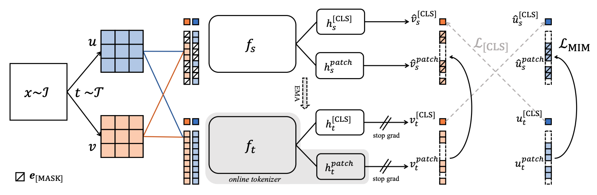
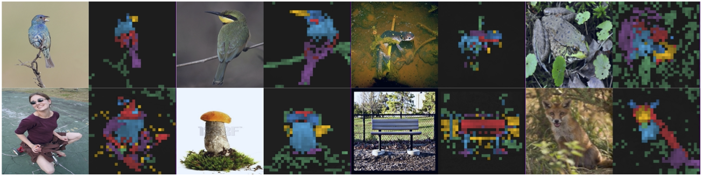
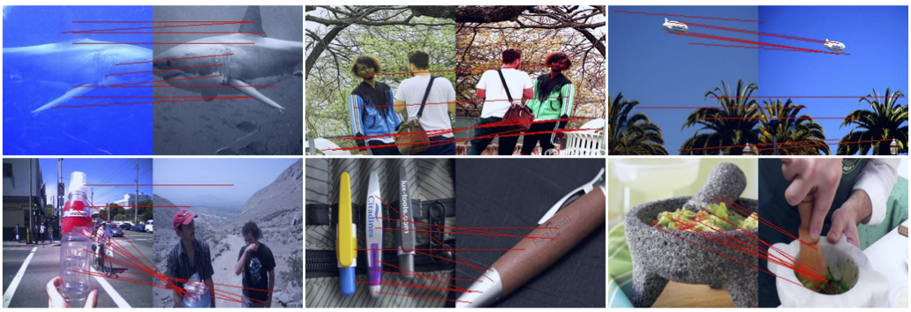
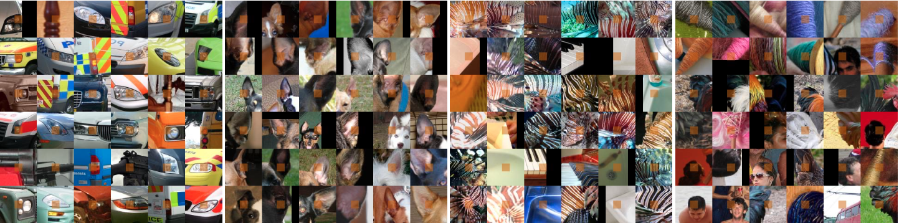
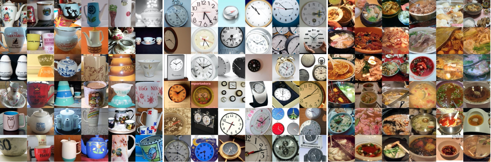

# Image BERT Pre-Training with iBOT 

[](https://paperswithcode.com/sota/unsupervised-image-classification-on-imagenet?p=ibot-image-bert-pre-training-with-online) \
[](https://paperswithcode.com/sota/self-supervised-image-classification-on?p=ibot-image-bert-pre-training-with-online) \
[](https://paperswithcode.com/sota/self-supervised-image-classification-on-1?p=ibot-image-bert-pre-training-with-online)

Official PyTorch implementation and pre-trained models for paper **iBOT: Image BERT Pre-Training with Online Tokenizer**. 

[[`arXiv`](https://arxiv.org/abs/2111.07832)] [[`Colab`](https://colab.research.google.com/github/bytedance/ibot/blob/main/notebooks/iBOT_demo.ipynb)] [[`BibTex`](https://github.com/bytedance/ibot#citing-ibot)]

<div align="center">
  
</div>

iBOT is a novel self-supervised pre-training framework that performs masked image modeling with self-distillation. iBOT pre-trained model shows local semantic features, which helps the model transfer well to downstream tasks both at a global scale and a local scale. For example, iBOT achieves strong performance on COCO object detection (**51.2 box AP** and **44.2 mask AP**) and ADE20K semantic segmentation (**50.0 mIoU**) with vanilla ViT-B/16. iBOT can also extract semantic-meaningful local parts, like **dog's ear :dog:**.

## News :tada:
- January 2022 - The paper is accepted by ICLR 2022.
- Update - ViT-L/16 with ImageNet-1K pre-training achieves **81.0%** in linear probing accuracy. ViT-L/16 with ImageNet-22K pre-training achieves **87.8%** in 512x fine-tuning accuracy.
- Update - Random masking with a relatively larger prediction ratio performs slighly better than block-wise masking. For example, ViT-B/16 achieves an **84.1%** fine-tuning accuracy and a **51.5 box AP** in object detection. 
- December 2021 - Release the code and pre-trained [models](https://github.com/bytedance/ibot#pre-trained-models).
- November 2021 - Release the pre-print on [arXiv](https://arxiv.org/abs/2111.07832).

## Installation

See [installation structions](https://github.com/bytedance/ibot/blob/main/INSTALL.md) for details.

## One-Line Command by Using `run.sh`

We provide `run.sh` with which you can complete the pre-training + fine-tuning experiment cycle in an one-line command.

### Arguments

- `TYPE` is named by the rule of dataset_task. For example, pre-training on ImageNet-1K has a TYPE of imagenet_pretrain and linear probing evalution on ImageNet-1K has a TYPE of imagenet_linear. Different types of task can be appended in one command.
- `JOB_NAME` is the customized job name to distinguish from different groups of experiments.
- `ARCH` is the architecture of the pre-trained models.
- `KEY` chooses which pre-trained model to be evaluated and can be set as either teacher (generally better) or student for one model. 
- `GPUS` is GPUs needed for each node, and will be clamped by `MAX_GPUS` (default as 8).
- Other additional arguments can directly appended after these required ones. For example, `--lr 0.001`.

For example, the following command will automatically evaluate the models on K-NN and linear probing benchmark after the pre-training with `student` and `teacher` model distributed across 2 nodes:
```
TOTAL_NODES=2 NODE_ID=0 ./run.sh imagenet_pretrain+imagenet_knn+imagenet_linear vit_small student,teacher 16 // the first node
TOTAL_NODES=2 NODE_ID=1 ./run.sh imagenet_pretrain+imagenet_knn+imagenet_linear vit_small student,teacher 16 // the second node
```

## Training

For a glimpse at the full documentation of iBOT pre-training, please run:
```
python main_ibot.py --help
```

### iBOT Pre-Training with ViTs

To start the iBOT pre-training with Vision Transformer (ViT), simply run the following commands. `JOB_NAME` is a customized argument to distinguish different experiments and this will automatically save checkpoints into the seperate folders.
```
./run.sh imagenet_pretrain $JOB_NAME vit_{small,base,large} teacher {16,24,64}
```
The exact arguments to reproduce the models presented in our paper can be found in the `args` column of the pre-trained [models](https://github.com/bytedance/ibot#pre-trained-models). We also provide the logs for pre-training to help reproducibility.

For example, run iBOT with ViT-S/16 network on two nodes with 8 GPUs for 800 epochs with the following command. The resulting checkpoint should reach 75.2% on k-NN accuracy, 77.9% on linear probing accuracy, and 82.3% on fine-tuning accuracy.

```
./run.sh imagenet_pretrain $JOB_NAME vit_small teacher 16 \
  --teacher_temp 0.07 \
  --warmup_teacher_temp_epochs 30 \
  --norm_last_layer false \
  --epochs 800 \
  --batch_size_per_gpu 64 \
  --shared_head true \
  --out_dim 8192 \
  --local_crops_number 10 \
  --global_crops_scale 0.25 1 \
  --local_crops_scale 0.05 0.25 \
  --pred_ratio 0 0.3 \
  --pred_ratio_var 0 0.2
```

### iBOT Pre-Training with Swins
This code also works for training iBOT on Swin Transformer (Swin). In the paper, we only conduct experiments on Swin-T with different window sizes:
```
./run.sh imagenet_pretrain $JOB_NAME swin_tiny teacher {16,40} \
  --patch_size 4 \
  --window_size {7,14}
```

For example, run iBOT with Swin-T/14 network on five nodes with 8 GPUS for 300 epochs with the following command. The resulting checkpoint should reach 76.2% on k-NN accuracy, 79.3% on linear probing accuracy.

```
./run.sh imagenet_pretrain $JOB_NAME swin_tiny teacher 40 \
  --teacher_temp 0.07 \
  --warmup_teacher_temp_epochs 30 \
  --norm_last_layer false \
  --epochs 300 \
  --batch_size_per_gpu 26 \
  --shared_head true \
  --out_dim 8192 \
  --local_crops_number 10 \
  --global_crops_scale 0.25 1 \
  --local_crops_scale 0.05 0.25 \
  --pred_ratio 0 0.3 \
  --pred_ratio_var 0 0.2 \
  --pred_start_epoch 50 \
  --patch_size 4 \
  --window_size 14 
```

## Pre-Trained Models

You can choose to download only the weights of the pre-trained `backbone` used for downstream tasks, and the `full ckpt` which contains backbone and projection head weights for both student and teacher networks. For the `backbone`, `s` denotes that the student network is selected while `t` denotes that the teacher network is selected. `PS` denotes prediction shape.

<table>
  <tr>
    <th>Arch.</th>
    <th>Par.</th>
    <th>PS</th>
    <th>k-NN</th>
    <th>Lin.</th>
    <th>Fin.</th>
    <th colspan="6">download</th>
  </tr>
  <tr>
    <td>ViT-S/16</td>
    <td>21M</td>
    <td>Block</td>
    <td>75.2%</td>
    <td>77.9%</td>
    <td>82.3%</td>
    <td><a href="https://lf3-nlp-opensource.bytetos.com/obj/nlp-opensource/archive/2022/ibot/vits_16/checkpoint_teacher.pth">backbone (t)</a></td>
    <td><a href="https://lf3-nlp-opensource.bytetos.com/obj/nlp-opensource/archive/2022/ibot/vits_16/checkpoint.pth">full ckpt</a></td>
    <td><a href="https://lf3-nlp-opensource.bytetos.com/obj/nlp-opensource/archive/2022/ibot/vits_16/args.txt">args</a></td>
    <td><a href="https://lf3-nlp-opensource.bytetos.com/obj/nlp-opensource/archive/2022/ibot/vits_16/log.txt">logs</a></td>
  </tr>
  <tr>
    <td>Swin-T/7</td>
    <td>28M</td>
    <td>Block</td>
    <td>75.3%</td>
    <td>78.6%</td>
    <td>\</td>
    <td><a href="https://lf3-nlp-opensource.bytetos.com/obj/nlp-opensource/archive/2022/ibot/swint_7/checkpoint_teacher.pth">backbone (t)</a></td>
    <td><a href="https://lf3-nlp-opensource.bytetos.com/obj/nlp-opensource/archive/2022/ibot/swint_7/checkpoint.pth">full ckpt</a></td>
    <td><a href="https://lf3-nlp-opensource.bytetos.com/obj/nlp-opensource/archive/2022/ibot/swint_7/args.txt">args</a></td>
    <td><a href="https://lf3-nlp-opensource.bytetos.com/obj/nlp-opensource/archive/2022/ibot/swint_7/log.txt">logs</a></td>
  </tr>
  <tr>
    <td>Swin-T/14</td>
    <td>28M</td>
    <td>Block</td>
    <td>76.2%</td>
    <td>79.3%</td>
    <td>\</td>
    <td><a href="https://lf3-nlp-opensource.bytetos.com/obj/nlp-opensource/archive/2022/ibot/swint_14/checkpoint_teacher.pth">backbone (t)</a></td>
    <td><a href="https://lf3-nlp-opensource.bytetos.com/obj/nlp-opensource/archive/2022/ibot/swint_14/checkpoint.pth">full ckpt</a></td>
    <td><a href="https://lf3-nlp-opensource.bytetos.com/obj/nlp-opensource/archive/2022/ibot/swint_14/args.txt">args</a></td>
    <td><a href="https://lf3-nlp-opensource.bytetos.com/obj/nlp-opensource/archive/2022/ibot/swint_14/log.txt">logs</a></td>
  </tr>
  <tr>
    <td>ViT-B/16</td>
    <td>85M</td>
    <td>Block</td>
    <td>77.1%</td>
    <td>79.5%</td>
    <td>84.0%</td>
    <td><a href="https://lf3-nlp-opensource.bytetos.com/obj/nlp-opensource/archive/2022/ibot/vitb_16/checkpoint_teacher.pth">backbone (t)</a></td>
    <td><a href="https://lf3-nlp-opensource.bytetos.com/obj/nlp-opensource/archive/2022/ibot/vitb_16/checkpoint.pth">full ckpt</a></td>
    <td><a href="https://lf3-nlp-opensource.bytetos.com/obj/nlp-opensource/archive/2022/ibot/vitb_16/args.txt">args</a></td>
    <td><a href="https://lf3-nlp-opensource.bytetos.com/obj/nlp-opensource/archive/2022/ibot/vitb_16/log.txt">logs</a></td>
  </tr>
  <tr>
    <td>ViT-B/16</td>
    <td>85M</td>
    <td>Rand</td>
    <td>77.3%</td>
    <td>79.8%</td>
    <td>84.1%</td>
    <td><a href="https://lf3-nlp-opensource.bytetos.com/obj/nlp-opensource/archive/2022/ibot/vitb_16_rand_mask/checkpoint_teacher.pth">backbone (t)</a></td>
    <td><a href="https://lf3-nlp-opensource.bytetos.com/obj/nlp-opensource/archive/2022/ibot/vitb_16_rand_mask/checkpoint.pth">full ckpt</a></td>
    <td><a href="https://lf3-nlp-opensource.bytetos.com/obj/nlp-opensource/archive/2022/ibot/vitb_16_rand_mask/args.txt">args</a></td>
    <td><a href="https://lf3-nlp-opensource.bytetos.com/obj/nlp-opensource/archive/2022/ibot/vitb_16_rand_mask/log.txt">logs</a></td>
  </tr>
  <tr>
    <td>ViT-L/16</td>
    <td>307M</td>
    <td>Block</td>
    <td>78.0%</td>
    <td>81.0%</td>
    <td>84.8%</td>
    <td><a href="https://lf3-nlp-opensource.bytetos.com/obj/nlp-opensource/archive/2022/ibot/vitl_16/checkpoint_teacher.pth">backbone (t)</a></td>
    <td><a href="https://lf3-nlp-opensource.bytetos.com/obj/nlp-opensource/archive/2022/ibot/vitl_16/checkpoint.pth">full ckpt</a></td>
    <td><a href="https://lf3-nlp-opensource.bytetos.com/obj/nlp-opensource/archive/2022/ibot/vitl_16/args.txt">args</a></td>
    <td><a href="https://lf3-nlp-opensource.bytetos.com/obj/nlp-opensource/archive/2022/ibot/vitl_16/log.txt">logs</a></td>
  </tr>
  <tr>
    <td>ViT-L/16</td>
    <td>307M</td>
    <td>Rand</td>
    <td>77.7%</td>
    <td>81.3%</td>
    <td>85.0%</td>
    <td><a href="https://lf3-nlp-opensource.bytetos.com/obj/nlp-opensource/archive/2022/ibot/vitl_16_rand_mask/checkpoint_teacher.pth">backbone (t)</a></td>
    <td><a href="https://lf3-nlp-opensource.bytetos.com/obj/nlp-opensource/archive/2022/ibot/vitl_16_rand_mask/checkpoint.pth">full ckpt</a></td>
    <td><a href="https://lf3-nlp-opensource.bytetos.com/obj/nlp-opensource/archive/2022/ibot/vitl_16_rand_mask/args.txt">args</a></td>
    <td><a href="https://lf3-nlp-opensource.bytetos.com/obj/nlp-opensource/archive/2022/ibot/vitl_16_rand_mask/log.txt">logs</a></td>
  </tr>
</table>

We also provide the ViT-{B,L}/16 model pre-trained on ImageNet-22K dataset.

 <table>
  <tr>
    <th rowspan="2">Arch.</th>
    <th rowspan="2">Par.</th>
    <th rowspan="2">PS</th>
    <th rowspan="2">k-NN</th>
    <th rowspan="2">Lin.</th>
    <th colspan="3">Fin.</th>
    <th rowspan="2" colspan="6">download</th>
  </tr>
  <tr>
  <th>256</th>
  <th>384</th>
  <th>512</th>
  </tr>
  <tr>
    <td>ViT-B/16</td>
    <td>85M</td>
    <td>Block</td>
    <td>71.1%</td>
    <td>79.0%</td>
    <td>84.4%</td>
    <td>\</td>
    <td>\</td>
    <td><a href="https://lf3-nlp-opensource.bytetos.com/obj/nlp-opensource/archive/2022/ibot/vitb_16_pt22k/checkpoint_student.pth">backbone (s)</a></td>
    <td><a href="https://lf3-nlp-opensource.bytetos.com/obj/nlp-opensource/archive/2022/ibot/vitb_16_pt22k/checkpoint.pth">full ckpt</a></td>
    <td><a href="https://lf3-nlp-opensource.bytetos.com/obj/nlp-opensource/archive/2022/ibot/vitb_16_pt22k/args.txt">args</a></td>
    <td><a href="https://lf3-nlp-opensource.bytetos.com/obj/nlp-opensource/archive/2022/ibot/vitb_16_pt22k/log.txt">logs</a></td>
  </tr>
  <tr>
    <td>ViT-L/16</td>
    <td>307M</td>
    <td>Block</td>
    <td>72.9%</td>
    <td>82.3%</td>
    <td>86.6%</td>
    <td>87.5%</td>
    <td>87.8%</td>
    <td><a href="https://lf3-nlp-opensource.bytetos.com/obj/nlp-opensource/archive/2022/ibot/vitl_16_pt22k/checkpoint_student.pth">backbone (s)</a></td>
    <td><a href="https://lf3-nlp-opensource.bytetos.com/obj/nlp-opensource/archive/2022/ibot/vitl_16_pt22k/checkpoint.pth">full ckpt</a></td>
    <td><a href="https://lf3-nlp-opensource.bytetos.com/obj/nlp-opensource/archive/2022/ibot/vitl_16_pt22k/args.txt">args</a></td>
    <td><a href="https://lf3-nlp-opensource.bytetos.com/obj/nlp-opensource/archive/2022/ibot/vitl_16_pt22k/log.txt">logs</a></td>
  </tr>
</table>

To extract the backbone from the full checkpoint by yourself, please run the following command where `KEY` being either student or teacher.
```
WEIGHT_FILE=$OUTPUT_DIR/checkpoint_$KEY.pth

python extract_backbone_weights.py \
  --checkpoint_key $KEY \
  $PRETRAINED \
  $WEIGHT_FILE \
```

## Downstream Evaluation

See [Evaluating iBOT on Downstream Tasks](https://github.com/bytedance/ibot/blob/main/evaluation/README.md) for details.

## Property Analysis

See [Analyzing iBOT's Properties](https://github.com/bytedance/ibot/blob/main/analysis/README.md) for robustness test and visualizing self-attention map:
<div align="center">
  
</div>

or extracting sparse correspondence pairs between two images: 
<div align="center">
  
</div>

We also provide a [Colab page](https://colab.research.google.com/github/bytedance/ibot/blob/main/notebooks/iBOT_demo.ipynb) :bookmark_tabs: you can play around with iBOT pre-trained models.

## Extracting Semantic Patterns

We extract top-k numbered local classes based on patch tokens with their corresponding patches and contexts by running the following command. We indentify very diverse behaviour like shared **low-level textures** and **high-level semantics**.
```
python3 -m torch.distributed.launch --nproc_per_node=8 \
    --master_port=${MASTER_PORT:-29500} \
    analysis/extract_pattern/extract_topk_cluster.py \
    --pretrained_path $PRETRAINED \
    --checkpoint {student,teacher} \
    --type patch \
    --topk 36 \
    --patch_window 5 \
    --show_pics 20 \
    --arch vit_small \
    --save_path memory_bank_patch.pth \
    --data_path data/imagenet/val
```
<div align="center">
  
</div>

The script also supports to extract the patern layout on the [CLS] token, which is actually doing clustering or unsupervised classification. This property is not induced by MIM objective since we also spot this feature on DINO.

```
python3 -m torch.distributed.launch --nproc_per_node=8 \
    --master_port=${MASTER_PORT:-29500} \
    analysis/extract_pattern/extract_topk_cluster.py \
    --pretrained_path $PRETRAINED \
    --checkpoint {student,teacher} \
    --type cls \
    --topk 36 \
    --show_pics 20 \
    --arch vit_small \
    --save_path memory_bank_cls.pth \
    --data_path data/imagenet/val
```
<div align="center">
  
</div>


## Acknowledgement

This repository is built using the [DINO](https://github.com/facebookresearch/dino) repository and the [BEiT](https://github.com/microsoft/unilm/tree/master/beit) repository.

## License
This repository is released under the Apache 2.0 license as found in the [LICENSE](LICENSE) file.

## Citing iBOT
If you find this repository useful, please consider giving a star :star: and citation:
```
@article{zhou2021ibot,
  title={iBOT: Image BERT Pre-Training with Online Tokenizer},
  author={Zhou, Jinghao and Wei, Chen and Wang, Huiyu and Shen, Wei and Xie, Cihang and Yuille, Alan and Kong, Tao},
  journal={International Conference on Learning Representations (ICLR)},
  year={2022}
}
```
